# Lumen Angular Videos (Backend)

Plataforma de videos basada en youtube, backend desarrollado con [Laravel](https://laravel.com/docs/5.5).

- Estandares de programacion PSR
- [Convencional commits](https://www.conventionalcommits.org/en/v1.0.0/)
- [Laravel](https://laravel.com/docs/5.5)
- Testing

#### Repositorio del frontend:
[https://github.com/andres0615/f-lumen-angular-videos](https://github.com/andres0615/f-lumen-angular-videos)

### Capturas de pantalla

#### Reproductor de video

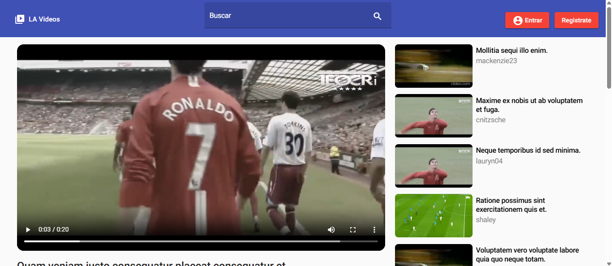

*Figura 1: Reproductor de video y videos relacionados.*

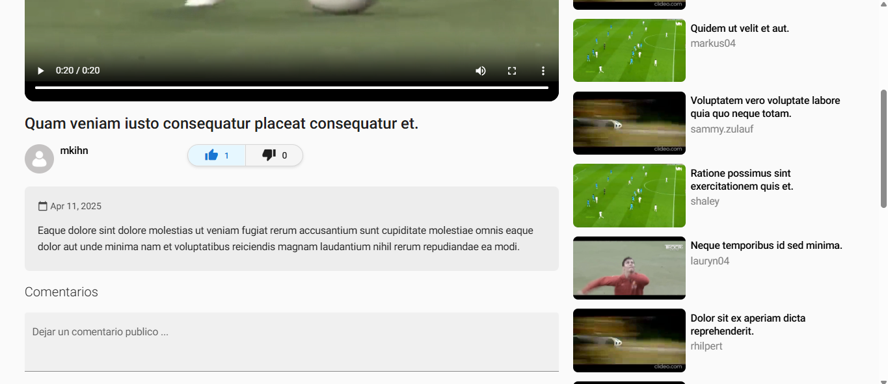

*Figura 2: Seccion con la descripcion y mas informacion del video.*

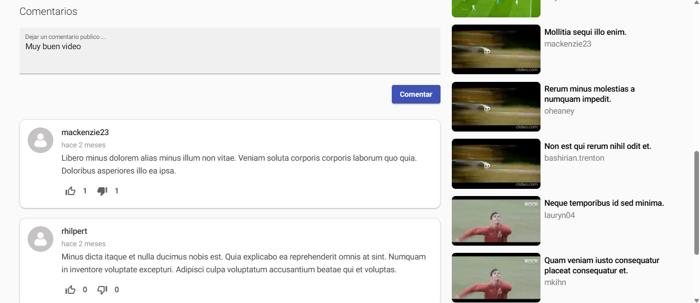

*Figura 3: Seccion de comentarios del video.*

#### Login

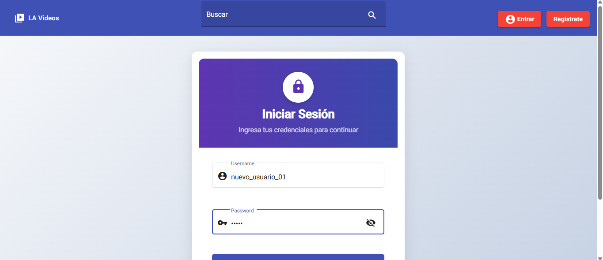

*Figura 4: inicio de sesion.*

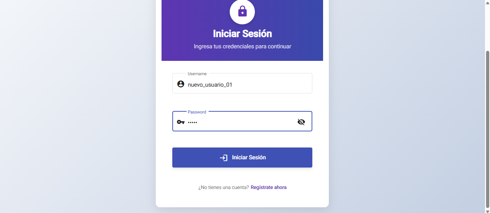

*Figura 5: inicio de sesion.*

#### Registrarse

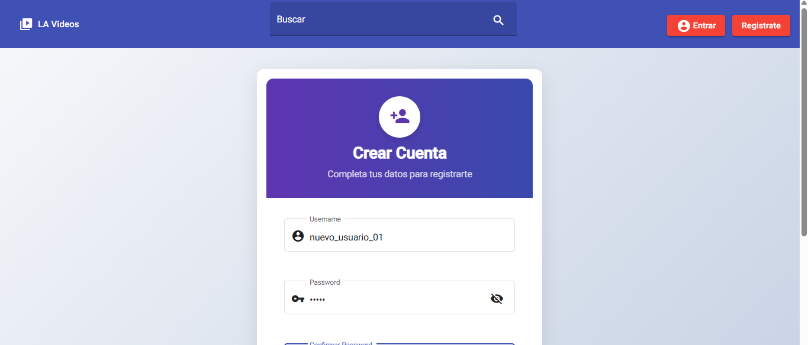

*Figura 6: Registro de usuario.*

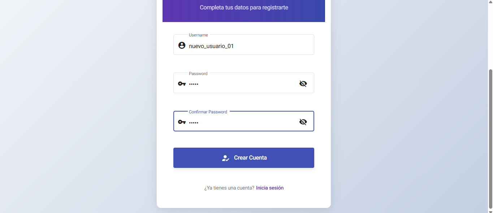

*Figura 7: Registro de usuario.*

#### Administracion de videos

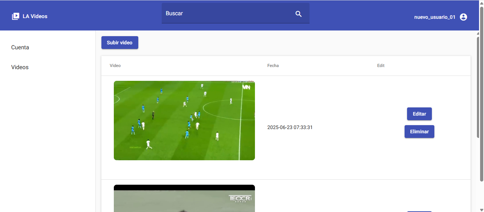

*Figura 8: Lista de videos subidos.*

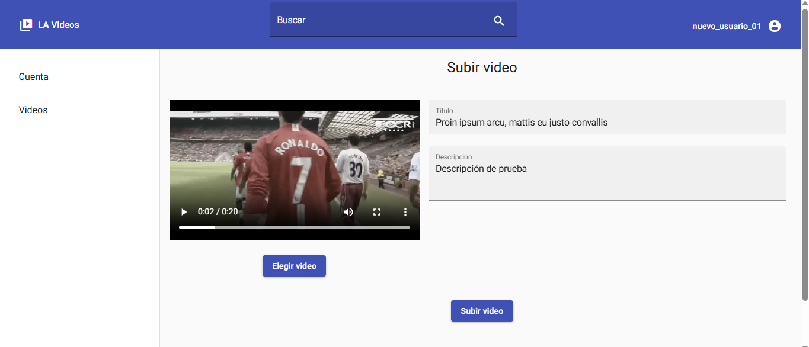

*Figura 9: Seccion para subir video.*

#### Canal de usuario

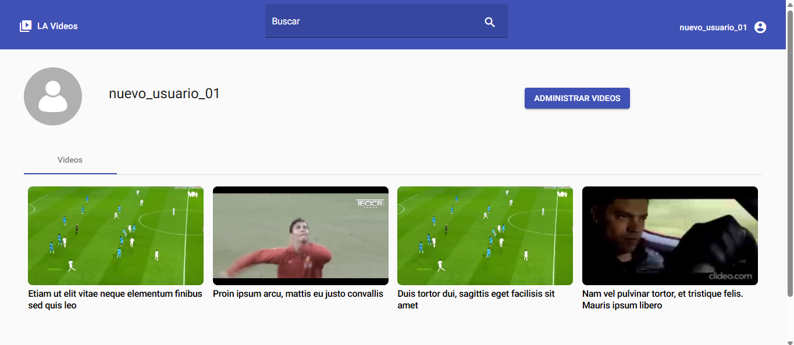

*Figura 10: Canal de usuario.*

#### Buscador de videos

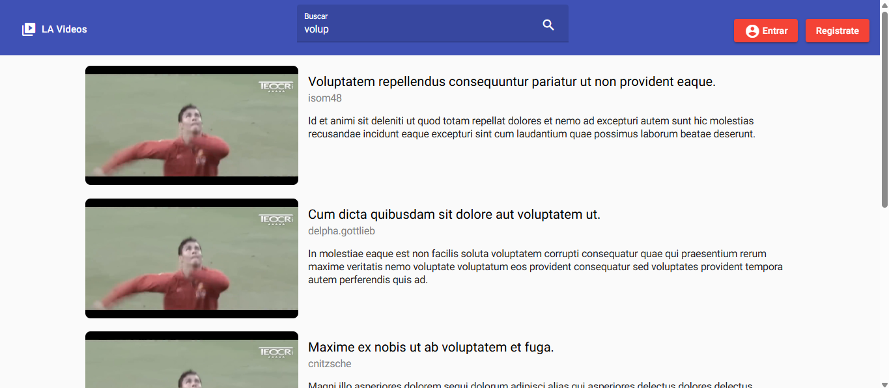

*Figura 11: Resultados de busqueda.*